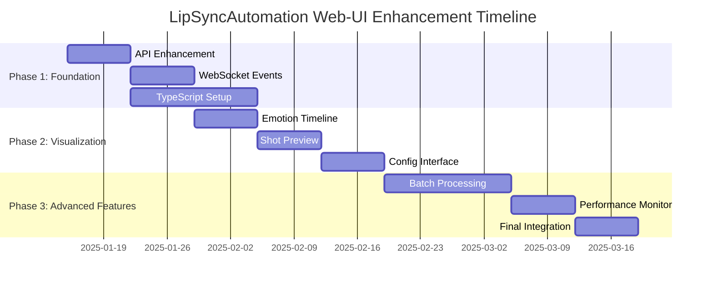

# LipSyncAutomation Web-UI Enhancement Plan

## **Executive Summary**

The current LipSyncAutomation web-ui significantly underutilizes the sophisticated backend capabilities. This plan outlines a comprehensive enhancement strategy to transform the interface from a basic processing tool into a professional cinematographic platform that fully exposes the advanced AI-driven features.

## **Current State Analysis**

### **Backend Utilization: 40%**
- ✅ Basic profile management and processing jobs exposed
- ❌ Cinematography engine (DecisionEngine, TensionEngine) completely hidden
- ❌ Emotion analysis details trapped in backend
- ❌ Advanced video composition features inaccessible

### **Frontend Completeness: 25%**
- ✅ Basic dashboard, profile management, processing page
- ❌ No cinematography controls or visualization
- ❌ No emotion analysis interface
- ❌ No real-time processing details

## **Strategic Goals**

1. **Expose Hidden Capabilities**: Make cinematography and emotion analysis systems accessible
2. **Enhance User Control**: Provide granular control over AI decisions
3. **Improve Visualization**: Add comprehensive visual feedback for all processes
4. **Enable Professional Workflows**: Support batch processing and advanced configurations
5. **Optimize Performance**: Ensure responsive interface for complex operations

## **Phase 1: Foundation API Enhancement (Weeks 1-3)**

### **Backend API Development**

#### **1.1 Cinematography Exposure**
- [ ] **GET/PUT /api/cinematography/config**
  - Expose cinematography rules and weight configurations
  - Allow runtime adjustment of decision parameters
  - Return current rule set with descriptions

- [ ] **GET /api/cinematography/rules**
  - Retrieve all cinematography rules with metadata
  - Include psycho-mapping explanations
  - Provide rule activation status

- [ ] **POST /api/cinematography/overrides**
  - Allow manual shot selection overrides
  - Support temporary and permanent rule modifications
  - Validate override compatibility

#### **1.2 Emotion Analysis API**
- [ ] **GET /api/emotions/analyze/{audio_id}**
  - Return detailed emotion segmentation data
  - Include confidence scores and valence/arousal values
  - Provide timing information for each segment

- [ ] **GET /api/emotions/segments/{job_id}**
  - Retrieve emotion analysis for specific processing jobs
  - Include raw audio features used for analysis
  - Provide alternative emotion suggestions

- [ ] **POST /api/emotions/manual-adjustment**
  - Allow manual emotion segment adjustment
  - Support confidence score modifications
  - Validate emotion continuity rules

#### **1.3 Enhanced Processing Endpoints**
- [ ] **GET /api/jobs/{id}/shot-sequence**
  - Return complete shot sequence with cinematographic metadata
  - Include decision reasoning and confidence scores
  - Provide alternative shot suggestions

- [ ] **GET /api/jobs/{id}/emotion-analysis**
  - Detailed emotion analysis for completed jobs
  - Include segment-by-segment breakdown
  - Provide emotional transition analysis

- [ ] **POST /api/batch/process**
  - Support multiple file processing
  - Include queue management and prioritization
  - Provide batch progress tracking

#### **1.4 System Monitoring**
- [ ] **GET /api/system/performance**
  - Resource utilization metrics
  - Processing time analytics
  - System health indicators

### **WebSocket Enhancement**

#### **1.5 Real-time Event Streaming**
- [ ] **Emotion Segment Events**
  ```json
  {
    "type": "emotion_segment_processed",
    "timestamp": "2025-01-15T10:30:00Z",
    "segment": {
      "start_time": 2.5,
      "end_time": 4.2,
      "emotion": "joy",
      "confidence": 0.87,
      "valence": 0.8,
      "arousal": 0.6
    }
  }
  ```

- [ ] **Cinematographic Decision Events**
  ```json
  {
    "type": "shot_decision_made",
    "emotion": "joy",
    "selected_shot": "CU",
    "vertical_angle": "eye_level",
    "confidence": 0.92,
    "reasoning": "High intensity joy suggests close-up engagement"
  }
  ```

- [ ] **Processing Stage Events**
  ```json
  {
    "type": "processing_stage_update",
    "stage": "emotion_analysis",
    "progress": 0.65,
    "estimated_completion": "2025-01-15T10:35:00Z"
  }
  ```

## **Phase 2: Frontend Visualization Components (Weeks 4-6)**

### **2.1 Core Visualization Components**

#### **EmotionAnalysisViewer Component**
- [ ] **Timeline Visualization**
  - Interactive timeline with emotion segments
  - Confidence score overlays
  - Hover tooltips with detailed information
  - Segment selection and editing capabilities

- [ ] **Dimensional Display**
  - Valence/arousal 2D plot
  - Emotional trajectory visualization
  - Transition path analysis
  - Comparative emotion mapping

- [ ] **Interactive Controls**
  - Click-to-edit emotion segments
  - Confidence score adjustment sliders
  - Emotion override dropdown
  - Real-time preview updates

#### **ShotSequencePreview Component**
- [ ] **Storyboard Interface**
  - Visual shot sequence with thumbnails
  - Angle and emotion indicators
  - Duration and timing visualization
  - Shot type icons and labels

- [ ] **Interactive Editing**
  - Drag-and-drop shot reordering
  - Click-to-change shot angles
  - Duration adjustment handles
  - Real-time preview generation

- [ ] **Metadata Display**
  - Decision confidence scores
  - Cinematographic reasoning
  - Alternative shot suggestions
  - Override status indicators

#### **CinematographyConfig Component**
- [ ] **Weight Adjustment Interface**
  - Sliders for cinematography rule weights
  - Real-time preview of weight changes
  - Reset to default functionality
  - Preset management system

- [ ] **Rule Management**
  - Enable/disable individual rules
  - Rule priority adjustment
  - Custom rule creation interface
  - Rule validation system

- [ ] **Preset System**
  - Save/load configuration presets
  - Shareable preset templates
  - Factory preset library
  - Import/export functionality

### **2.2 Processing Interface Components**

#### **ProcessingStagesIndicator**
- [ ] **Stage Visualization**
  - Multi-stage progress indicator
  - Current stage highlighting
  - Estimated completion times
  - Error state handling

- [ ] **Performance Metrics**
  - Processing speed indicators
  - Resource utilization display
  - Comparison with historical performance
  - Optimization suggestions

#### **BatchQueueManager**
- [ ] **Queue Visualization**
  - Visual queue representation
  - Job prioritization controls
  - Parallel processing indicators
  - Queue manipulation interface

- [ ] **Batch Operations**
  - Multi-file upload interface
  - Batch configuration application
  - Progress aggregation display
  - Results comparison tools

### **2.3 New Page Structure**

#### **Cinematography Dashboard (/cinematography)**
- [ ] **Configuration Overview**
  - Current cinematography settings
  - Rule activation status
  - Performance impact indicators
  - Recent decisions summary

- [ ] **Quick Actions**
  - Rule preset switching
  - Weight adjustment shortcuts
  - Override management
  - System reset options

#### **Emotion Analysis Page (/analyze)**
- [ ] **Analysis Interface**
  - Audio upload and analysis
  - Real-time emotion detection
  - Segment editing tools
  - Analysis result export

- [ ] **Comparison Tools**
  - Multiple analysis comparison
  - Before/after adjustment views
  - Alternative emotion suggestions
  - Analysis quality metrics

#### **Batch Processing Page (/batch)**
- [ ] **Batch Management**
  - Multi-file upload interface
  - Batch configuration setup
  - Queue management tools
  - Progress monitoring dashboard

#### **System Monitoring Page (/monitor)**
- [ ] **Performance Dashboard**
  - System resource utilization
  - Processing time analytics
  - Error rate monitoring
  - Optimization recommendations

## **Phase 3: Advanced Features & Professional Tools (Weeks 7-8)**

### **3.1 Professional Workflow Features**

#### **Interactive Shot Sequence Editor**
- [ ] **Timeline-Based Editing**
  - Multi-track timeline interface
  - Synchronized audio waveform display
  - Shot boundary adjustment tools
  - Real-time preview generation

- [ ] **Advanced Override System**
  - Manual shot selection with reasoning
  - Custom angle assignment
  - Duration fine-tuning
  - Override validation and suggestions

#### **Collaboration Features**
- [ ] **Multi-User Support**
  - Shared project editing
  - Real-time collaboration indicators
  - Change tracking and comments
  - User permission management

### **3.2 System Optimization Features**

#### **Performance Monitoring Dashboard**
- [ ] **Resource Analytics**
  - CPU/GPU utilization tracking
  - Memory usage patterns
  - I/O performance metrics
  - Bottleneck identification

- [ ] **Optimization Tools**
  - Automatic performance tuning
  - Resource allocation suggestions
  - Processing queue optimization
  - Cache management utilities

#### **Configuration Management**
- [ ] **Advanced Preset System**
  - Hierarchical preset organization
  - Inheritance and override support
  - Version control integration
  - Team preset sharing

### **3.3 Integration & Export Features**

#### **API Integration**
- [ ] **External API Support**
  - RESTful API for external integration
  - Webhook support for job completion
  - Third-party tool connectors
  - API documentation and examples

#### **Export & Sharing**
- [ ] **Advanced Export Options**
  - Multiple format support
  - Metadata inclusion options
  - Batch export capabilities
  - Cloud storage integration

## **Technical Architecture Improvements**

### **4.1 State Management Enhancement**

#### **Global State Implementation**
- [ ] **Zustand Store Setup**
  ```typescript
  interface AppStore {
    // Profile management
    profiles: Profile[]
    activeProfile: Profile | null
    
    // Processing state
    activeJobs: Job[]
    processingQueue: Job[]
    
    // Cinematography settings
    cinematographyConfig: CinematographyConfig
    emotionAnalysis: EmotionAnalysis | null
    
    // UI state
    selectedSegments: EmotionSegment[]
    previewMode: 'storyboard' | 'timeline' | 'detailed'
  }
  ```

- [ ] **Specialized Stores**
  - Cinematography store for rule management
  - Processing store for job tracking
  - UI store for interface state

### **4.2 Component Architecture**

#### **Component Organization**
```
src/
├── components/
│   ├── cinematography/
│   │   ├── EmotionTimeline.tsx
│   │   ├── ShotSequencePreview.tsx
│   │   ├── CinematographyConfig.tsx
│   │   └── TensionCurve.tsx
│   ├── processing/
│   │   ├── JobMonitor.tsx
│   │   ├── BatchQueue.tsx
│   │   └── ProcessingStages.tsx
│   └── visualization/
│       ├── EmotionHeatmap.tsx
│       ├── Storyboard.tsx
│       └── PerformanceChart.tsx
├── hooks/
│   ├── useCinematography.ts
│   ├── useEmotionAnalysis.ts
│   └── useWebSocket.ts
├── stores/
│   ├── appStore.ts
│   ├── cinematographyStore.ts
│   └── processingStore.ts
└── types/
    ├── cinematography.ts
    ├── emotion.ts
    └── processing.ts
```

### **4.3 Performance Optimizations**

#### **Rendering Optimizations**
- [ ] **Virtual Scrolling**
  - Large dataset handling
  - Memory-efficient rendering
  - Smooth scrolling performance

- [ ] **Caching Strategy**
  - API response caching
  - Component memoization
  - Image preloading
  - Service worker implementation

#### **WebSocket Optimizations**
- [ ] **Connection Management**
  - Connection pooling
  - Automatic reconnection
  - Message batching
  - Latency optimization

## **Implementation Priority Matrix**

| Feature | User Impact | Technical Effort | Priority | Dependencies |
|---------|-------------|------------------|----------|--------------|
| Emotion Analysis API | **High** | Low | **1** | Backend endpoints |
| Shot Sequence Preview | **High** | Medium | **2** | WebSocket events |
| Cinematography Config | **High** | Medium | **3** | API exposure |
| Real-time Processing | Medium | High | 4 | State management |
| Batch Processing | Medium | High | 5 | Queue system |
| Performance Monitor | Low | Medium | 6 | Metrics collection |

## **Success Metrics**

### **Feature Utilization Targets**
- **Cinematography System Exposure**: 0% → 90%
- **Emotion Analysis Visibility**: 10% → 95%
- **Real-time Feedback Capability**: 20% → 85%
- **User Control Granularity**: 15% → 80%

### **Performance Goals**
- **Page Load Time**: < 2 seconds
- **WebSocket Latency**: < 100ms
- **Large Dataset Handling**: 1000+ emotion segments
- **Error Recovery**: 95% automatic recovery rate

### **User Experience Transformation**
- **Before**: Basic file upload → Wait → Download result
- **After**: Analyze emotions → Adjust cinematography → Preview shots → Optimize settings → Process with full control

## **Risk Assessment & Mitigation**

### **Technical Risks**
- **Backend API Changes**: Implement versioning and backward compatibility
- **Performance Bottlenecks**: Use caching and lazy loading strategies
- **WebSocket Scalability**: Implement connection pooling and message batching

### **User Experience Risks**
- **Feature Overload**: Progressive disclosure and user onboarding
- **Learning Curve**: Contextual help and interactive tutorials
- **Configuration Complexity**: Smart defaults and preset systems

## **Timeline Overview**



## **Conclusion**

This comprehensive enhancement plan will transform the LipSyncAutomation web-ui into a professional cinematographic platform that fully exposes the sophisticated AI-driven capabilities. The phased approach ensures manageable development while delivering incremental value to users.

The result will be a industry-leading interface that provides complete visibility and control over advanced cinematographic decision-making processes, positioning LipSyncAutomation as the premier AI-powered cinematography tool for professional content creation.