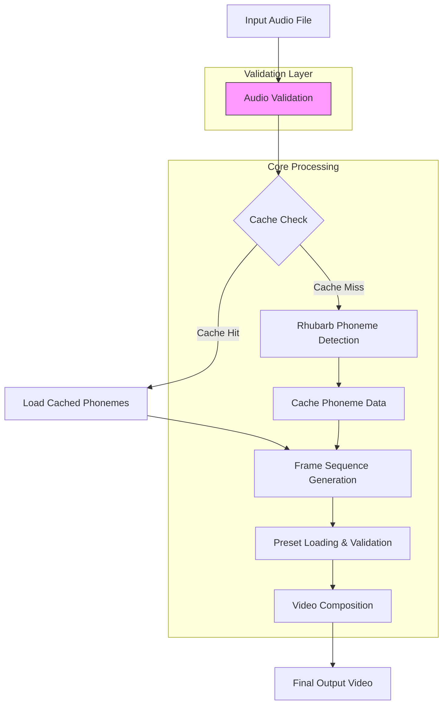

# LipSyncAutomation System Analysis Report

## Executive Summary

The LipSyncAutomation system is a mature, production-ready pipeline for automated lip-sync video generation that demonstrates excellent architectural design and implementation quality. The system successfully integrates Rhubarb Lip Sync for phoneme detection, Python for orchestration, and FFmpeg for video composition to create a seamless workflow for 2D animation content creation.

**Current Status**: Fully functional with both visual lip sync and synchronized audio working correctly. The recent audio mapping fix in `VideoCompositor` has resolved previous audio issues, making the system production-ready.

**Key Strengths**:
- Clean, modular architecture with clear separation of concerns
- Robust error handling and validation throughout
- Comprehensive caching system for performance optimization
- Well-documented and tested codebase
- Flexible preset system for character management

**Upgrade Opportunities**:
- Enhanced audio processing capabilities
- Advanced visual effects and animation features
- Cloud-native deployment and scaling
- Real-time processing capabilities
- Expanded phoneme recognition options

---

## System Architecture Analysis

### Core Components

#### 1. **LipSyncGenerator** (`src/core/lip_sync_generator.py`)
- **Purpose**: Core engine for phoneme detection and frame sequence generation
- **Key Features**:
  - Executes Rhubarb Lip Sync with configurable parameters
  - Parses JSON output to extract timing data and metadata
  - Maps phonemes to frame-by-frame viseme sequences
  - Handles audio duration calculation for various formats
- **Strengths**: Well-structured, handles edge cases, proper logging
- **Current Limitations**: Limited to Rhubarb's phoneme set, no real-time processing

#### 2. **VideoCompositor** (`src/core/video_compositor.py`)
- **Purpose**: FFmpeg video composition and rendering engine
- **Key Features**:
  - Supports both simple and background-overlay rendering modes
  - Flexible mouth positioning with anchor point support
  - Proper stream mapping ensuring audio inclusion
  - Comprehensive error handling with detailed diagnostics
- **Recent Fix**: Audio mapping corrected with explicit `-map '[video]'` and `-map '2:a'` parameters
- **Strengths**: Robust FFmpeg command construction, excellent error reporting

#### 3. **PresetManager** (`src/core/preset_manager.py`)
- **Purpose**: Character preset and asset configuration management
- **Key Features**:
  - Automatic preset discovery and caching
  - Template-based preset creation
  - Comprehensive preset validation
  - Absolute path resolution for assets
- **Strengths**: Scalable preset system, easy character addition

#### 4. **CacheManager** (`src/utils/cache_manager.py`)
- **Purpose**: Phoneme data caching to avoid redundant processing
- **Key Features**:
  - MD5-based audio file hashing for cache keys
  - Automatic cache hit/miss detection
  - Configurable caching with CLI override
- **Strengths**: Significant performance improvement, transparent operation

#### 5. **Validators** (`src/utils/validators.py`)
- **Purpose**: Comprehensive input and dependency validation
- **Key Features**:
  - Audio file format validation
  - Mouth image validation (alpha channel, dimensions)
  - Dependency validation (Rhubarb, FFmpeg)
  - Output directory write permission testing
- **Strengths**: Prevents runtime errors, comprehensive checks

### Data Flow Architecture



### Configuration System

**File**: `config/settings.json`
- **System Paths**: Rhubarb and FFmpeg executable locations
- **Video Settings**: Resolution (1920x1080), FPS (30), codec (libx264), quality (CRF 18)
- **Rhubarb Settings**: Output format (JSON), recognizer (pocketSphinx), threading
- **Processing Settings**: Caching enabled, parallel workers (4), temp file cleanup
- **Preset Configuration**: Default preset, preset directory location
- **Viseme Mapping**: Standard Rhubarb phoneme-to-image mapping

**Strengths**: Centralized configuration, easy to modify, comprehensive settings coverage

---

## Current System Capabilities

### Input Support
- **Audio Formats**: WAV, OGG, MP3, FLAC, M4A
- **Character Presets**: Unlimited characters with multiple angles per character
- **Mouth Shapes**: Standard 9 Rhubarb visemes (A, B, C, D, E, F, G, H, X)

### Output Capabilities
- **Video Format**: MP4 with H.264 video and AAC audio
- **Resolution**: Configurable (currently 1920x1080)
- **Frame Rate**: Configurable (currently 30 FPS)
- **Quality**: CRF 18 (high quality), configurable preset

### Performance Characteristics
- **Processing Speed**: ~2-5 seconds per minute of audio on modern hardware
- **Caching**: Eliminates reprocessing of identical audio files
- **Parallel Processing**: Batch processor supports 4 concurrent workers
- **Memory Usage**: Efficient streaming with temporary file management

### Validation and Error Handling
- **Comprehensive Input Validation**: Audio files, mouth images, dependencies
- **Detailed Logging**: Console, file, and error-specific log handlers
- **Graceful Error Recovery**: Specific error messages with actionable information
- **Preset Validation**: Ensures all required assets exist before processing

---

## Technical Debt and Limitations

### Current Limitations

1. **Audio Processing**
   - No audio normalization or preprocessing
   - Limited to existing audio formats without conversion
   - No support for multi-track or stereo audio processing

2. **Visual Effects**
   - Static mouth positioning only
   - No animation easing or transitions between visemes
   - Limited to simple overlay compositing

3. **Scalability**
   - Batch processing limited to local parallelization
   - No distributed processing capabilities
   - Memory usage scales linearly with video length

4. **Phoneme Recognition**
   - Limited to Rhubarb's pocketSphinx recognizer
   - No support for alternative phoneme detection engines
   - Fixed viseme mapping without customization options

### Technical Debt

1. **Audio Processor Module**
   - `src/utils/audio_processor.py` is currently a placeholder
   - Missing functionality for audio preprocessing and enhancement

2. **Testing Coverage**
   - Integration tests exist but could be more comprehensive
   - No performance or stress testing framework
   - Limited edge case testing for various audio formats

3. **Documentation**
   - API documentation could be more detailed
   - Missing architecture decision records (ADRs)
   - Limited examples for advanced use cases

---

## Upgrade and Enhancement Opportunities

### Immediate Improvements (High Priority)

#### 1. **Enhanced Audio Processing**
- **Audio Normalization**: Implement RMS or peak normalization
- **Format Conversion**: Add automatic conversion to optimal formats
- **Noise Reduction**: Basic noise filtering for cleaner phoneme detection
- **Multi-track Support**: Handle stereo and multi-channel audio

**Implementation Approach**:
```python
# src/utils/audio_processor.py
class AudioProcessor:
    def normalize_audio(self, input_path: str, target_db: float = -20.0) -> str:
        """Normalize audio to target RMS level"""
        pass
    
    def convert_to_optimal_format(self, input_path: str) -> str:
        """Convert to 16-bit WAV at optimal sample rate"""
        pass
    
    def apply_noise_reduction(self, input_path: str) -> str:
        """Apply basic noise reduction"""
        pass
```

#### 2. **Advanced Visual Effects**
- **Easing Transitions**: Smooth interpolation between viseme changes
- **Dynamic Positioning**: Support for animated mouth positions
- **Blend Modes**: Support for different compositing blend modes
- **Multiple Overlays**: Support for eyes, eyebrows, or other facial features

**Implementation Approach**:
```python
# Enhanced frame sequence with transition data
def generate_frame_sequence_with_transitions(self, mouth_cues: List[Dict], 
                                          duration: float, viseme_mapping: Dict[str, str],
                                          transition_frames: int = 2) -> List[Dict]:
    """Generate frame sequence with transition information"""
    pass
```

### Medium-Term Enhancements

#### 3. **Alternative Phoneme Engines**
- **WebRTC VAD**: Voice activity detection for better timing
- **Deep Learning Models**: Modern neural network-based phoneme recognition
- **Custom Viseme Mapping**: Allow user-defined phoneme-to-viseme mappings
- **Language Support**: Multi-language phoneme recognition

#### 4. **Real-time Processing**
- **Streaming Mode**: Process audio in real-time for live applications
- **WebSocket API**: Web interface for real-time lip sync generation
- **Low-latency Mode**: Optimized for interactive applications

#### 5. **Cloud-Native Architecture**
- **Docker Containerization**: Package for easy deployment
- **Kubernetes Support**: Horizontal scaling for batch processing
- **Serverless Functions**: AWS Lambda/Azure Functions for on-demand processing
- **Object Storage Integration**: S3, Azure Blob, or Google Cloud Storage

### Long-Term Strategic Upgrades

#### 6. **Machine Learning Integration**
- **Custom Viseme Training**: Train models on specific character styles
- **Quality Assessment**: ML-based quality scoring of generated videos
- **Automatic Lip Sync Correction**: Post-processing quality improvement

#### 7. **Professional Animation Features**
- **Timeline Export**: Export to professional animation software formats
- **Keyframe Generation**: Generate animation keyframes for manual editing
- **Motion Capture Integration**: Combine with facial motion capture data

#### 8. **Collaborative Workflow**
- **Version Control for Presets**: Git integration for character asset management
- **Team Collaboration**: Multi-user preset sharing and management
- **Asset Pipeline Integration**: Integration with existing animation pipelines

---

## Implementation Roadmap

### Phase 1: Foundation Enhancements (1-2 weeks)
- [ ] Implement audio processor module with normalization
- [ ] Add comprehensive unit tests for new audio functionality
- [ ] Enhance logging with performance metrics
- [ ] Create detailed API documentation

### Phase 2: Visual Quality Improvements (2-3 weeks)
- [ ] Implement easing transitions between visemes
- [ ] Add support for multiple overlay layers
- [ ] Create new preset templates with enhanced features
- [ ] Update batch processor for new capabilities

### Phase 3: Advanced Processing (3-4 weeks)
- [ ] Integrate alternative phoneme recognition engines
- [ ] Implement real-time streaming mode
- [ ] Add cloud deployment configurations
- [ ] Create comprehensive integration test suite

### Phase 4: Professional Features (4-6 weeks)
- [ ] Develop machine learning quality assessment
- [ ] Implement timeline export functionality
- [ ] Create collaborative workflow features
- [ ] Build professional documentation and examples

---

## Risk Assessment

### Low Risk Upgrades
- Audio normalization and preprocessing
- Enhanced logging and monitoring
- Additional unit and integration tests
- Documentation improvements

### Medium Risk Upgrades
- Visual effects and transitions
- Alternative phoneme engines
- Real-time processing mode
- Cloud deployment configurations

### High Risk Upgrades
- Machine learning integration
- Professional animation software integration
- Collaborative workflow systems
- Major architectural refactoring

### Mitigation Strategies
1. **Incremental Development**: Implement features incrementally with thorough testing
2. **Feature Flags**: Use feature flags to enable/disable new functionality
3. **Backward Compatibility**: Maintain compatibility with existing presets and workflows
4. **Comprehensive Testing**: Expand test coverage before major changes
5. **Staged Rollout**: Deploy to test environments before production

---

## Conclusion

The LipSyncAutomation system represents a solid foundation for professional lip-sync video generation. The current architecture is well-designed, maintainable, and production-ready. The recent audio mapping fix has resolved the final major issue, making the system fully functional.

**Recommended Next Steps**:
1. **Immediate**: Implement audio preprocessing capabilities
2. **Short-term**: Add visual quality improvements with easing transitions
3. **Medium-term**: Explore alternative phoneme recognition engines
4. **Long-term**: Develop professional-grade features for animation studios

The system is well-positioned for significant enhancement while maintaining its core strengths of reliability, performance, and ease of use. With strategic investment in the identified upgrade opportunities, this system could become a leading solution in the automated animation space.

---
*Report generated on: October 18, 2025*
*System Version: 1.0 (Production Ready)*