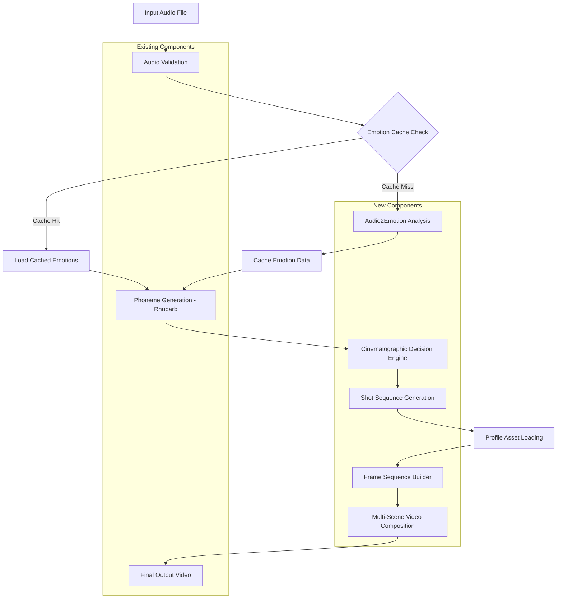

# LipSyncAutomation v2.0 - Phase 0: System Overview & Technical Foundation

## Document Control

**Project:** LipSyncAutomation System Upgrade to Emotion-Aware Multi-Angle Video Generation  
**Version:** 2.0.0  
**Date:** October 18, 2025  
**Status:** Implementation Ready  
**Classification:** Internal Development  

## Phase 0 Overview

**Duration:** 2-3 days  
**Team:** Lead Architect + 1 Senior Developer  
**Objective:** Establish architectural understanding and development infrastructure

### Executive Summary

#### Current System Capabilities
The existing LipSyncAutomation system provides:
- Audio-to-phoneme conversion using Rhubarb Lip Sync[1]
- Single-angle lip-synced video generation
- 9 viseme mouth shapes (A, B, C, D, E, F, G, H, X)
- FFmpeg-based video composition[2]
- Character preset system for asset management

#### Upgrade Objectives
Transform the system into a complete content creation platform with:
1. **Emotion-Aware Animation**: Multiple facial expressions per character
2. **Multi-Angle Cinematography**: Dynamic camera angles based on emotion/narrative
3. **Intelligent Shot Selection**: Rule-based cinematographic decision engine
4. **Profile System**: Structured asset hierarchy (Angles → Emotions → Visemes)

#### Key Architectural Changes

```
Current Architecture:
Audio → Phonemes → Single Viseme Set → Video

New Architecture:
Audio → Phonemes + Emotions → Multi-Angle Shot Selection → Emotion-Specific Visemes → Composite Video
```

### System Architecture Overview

#### Component Hierarchy

```
┌─────────────────────────────────────────────────────────────┐
│                  ContentOrchestrator                         │
│           (Master Pipeline Coordinator)                      │
└─────────────────────────────────────────────────────────────┘
                           │
        ┌──────────────────┼──────────────────┐
        │                  │                  │
        ▼                  ▼                  ▼
┌──────────────┐  ┌──────────────┐  ┌──────────────┐
│   Emotion    │  │Cinematographic│  │   Profile    │
│   Analyzer   │  │   Decision    │  │   Manager    │
│              │  │    Engine     │  │              │
└──────────────┘  └──────────────┘  └──────────────┘
        │                  │                  │
        │                  │                  │
        ▼                  ▼                  ▼
┌──────────────┐  ┌──────────────┐  ┌──────────────┐
│  LipSync     │  │    Video     │  │    Cache     │
│  Generator   │  │ Compositor   │  │   Manager    │
│  (Existing)  │  │   V2.0       │  │  (Enhanced)  │
└──────────────┘  └──────────────┘  └──────────────┘
```

#### New Components

##### 1. EmotionAnalyzer
**File:** `src/core/emotion_analyzer.py`  
**Purpose:** Audio-to-emotion segment conversion  
**Backend:** NVIDIA Audio2Emotion v3.0 or compatible model[3][1]
**Input:** Audio file (WAV, MP3, OGG)  
**Output:** Emotion segments with timing, valence, arousal, intensity

##### 2. CinematographicDecisionEngine
**File:** `src/core/cinematography/decision_engine.py`  
**Purpose:** Rule-based shot selection using psycho-cinematic principles  
**Input:** Emotion segments  
**Output:** Shot sequence (angle, distance, duration, transitions)

**Sub-components:**
- `psycho_mapper.py` - Emotion-to-shot mapping
- `tension_engine.py` - Narrative tension calculation  
- `grammar_machine.py` - Cinematographic grammar FSM

##### 3. ProfileManager (Enhanced)
**File:** `src/core/profile_manager.py`  
**Purpose:** Multi-angle, multi-emotion asset management  
**Replaces:** PresetManager (deprecated)  
**New Features:** Angle hierarchy, emotion blending, validation

##### 4. VideoCompositorV2
**File:** `src/core/video_compositor_v2.py`  
**Purpose:** Multi-scene composition with transitions  
**New Features:** Scene transitions (dissolve, fade, wipe), angle switching

### Data Flow Architecture

#### Complete Pipeline Flow



#### Data Schemas

##### Emotion Segment Schema
```json
{
  "segment_id": "string",
  "start_time": "float",
  "end_time": "float",
  "primary_emotion": {
    "name": "string (joy|sadness|anger|fear|surprise|disgust|trust|anticipation)",
    "confidence": "float (0-1)",
    "intensity": "float (0-1)",
    "valence": "float (-1 to +1)",
    "arousal": "float (0-1)"
  },
  "secondary_emotions": [
    {
      "name": "string",
      "confidence": "float",
      "intensity": "float"
    }
  ]
}
```

##### Shot Specification Schema
```json
{
  "scene_id": "string",
  "start_time": "float",
  "end_time": "float",
  "emotion_segment_ref": "string",
  "shot_specification": {
    "distance": "string (ECU|CU|MCU|MS|MLS|LS)",
    "angle": "string (high_angle|eye_level|low_angle|dutch)",
    "duration": "float"
  },
  "transition": {
    "type": "string (cut|dissolve|fade|wipe)",
    "duration": "float"
  },
  "emotion": "string"
}
```

### Technology Stack & Dependencies

#### Required Software

| Component | Version | Purpose |
|-----------|---------|---------|
| Python | 3.9+ | Core language |
| FFmpeg | 4.4+ | Video composition[2] |
| Rhubarb Lip Sync | 1.13+ | Phoneme detection |
| NumPy | 1.24+ | Array operations |
| OpenCV | 4.8+ | Image processing |
| Pillow | 10.0+ | Image manipulation |
| librosa | 0.10+ | Audio analysis |
| soundfile | 0.12+ | Audio I/O |

#### New Dependencies

| Package | Version | Purpose |
|---------|---------|---------|
| onnxruntime | 1.16+ | Audio2Emotion inference[1] |
| torch | 2.1+ (optional) | Alternative emotion models |
| scipy | 1.11+ | Signal processing |
| jsonschema | 4.19+ | JSON validation |

#### Installation Commands

```bash
# Core dependencies (existing)
pip install numpy==1.24.3 opencv-python==4.8.0.76 Pillow==10.0.0

# Audio processing
pip install librosa==0.10.1 soundfile==0.12.1 scipy==1.11.2

# Emotion analysis
pip install onnxruntime==1.16.0

# Optional: GPU acceleration
pip install onnxruntime-gpu==1.16.0  # If CUDA available

# Validation
pip install jsonschema==4.19.1
```

#### Directory Structure (New)

```
LipSyncAutomation/
├── src/
│   ├── core/
│   │   ├── lip_sync_generator.py          (existing)
│   │   ├── video_compositor.py            (existing - v1)
│   │   ├── preset_manager.py              (existing - deprecated)
│   │   ├── emotion_analyzer.py            (NEW)
│   │   ├── profile_manager.py             (NEW - replaces preset)
│   │   ├── video_compositor_v2.py         (NEW)
│   │   ├── content_orchestrator.py        (NEW)
│   │   └── cinematography/                (NEW)
│   │       ├── __init__.py
│   │       ├── decision_engine.py
│   │       ├── psycho_mapper.py
│   │       ├── tension_engine.py
│   │       ├── grammar_machine.py
│   │       └── override_manager.py
│   └── utils/
│       ├── validators.py                  (existing - enhance)
│       ├── cache_manager.py               (existing - enhance)
│       ├── audio_processor.py             (existing - implement)
│       └── emotion_utils.py               (NEW)
├── config/
│   ├── settings.json                      (existing - enhance)
│   ├── emotion_mapping.json               (NEW)
│   └── cinematography_rules.json          (NEW)
├── profiles/                               (NEW - replaces presets/)
│   ├── profile_manifest.json
│   └── [character_name]/
│       ├── profile_config.json
│       └── angles/
│           ├── ECU/
│           ├── CU/
│           ├── MCU/
│           └── MS/
├── models/                                 (NEW)
│   └── audio2emotion/
│       └── model.onnx
├── tests/
│   ├── unit/
│   │   ├── test_emotion_analyzer.py       (NEW)
│   │   ├── test_cinematography.py         (NEW)
│   │   └── test_profile_manager.py        (NEW)
│   └── integration/
│       └── test_full_pipeline.py          (NEW)
└── docs/
    └── development/                        (NEW)
        ├── phase_0_overview.md
        ├── phase_1_implementation.md
        ├── phase_2_implementation.md
        ├── phase_3_implementation.md
        └── phase_4_implementation.md
```

### Development Environment Setup

#### Step 1: Clone and Branch

```bash
# Clone repository
git clone <repository-url>
cd LipSyncAutomation

# Create development branch
git checkout -b feature/v2-emotion-cinematography

# Create phase tracking branches
git checkout -b phase-1-profiles-emotions
git checkout -b phase-2-cinematography
git checkout -b phase-3-composition
git checkout -b phase-4-testing
```

#### Step 2: Environment Setup

```bash
# Create virtual environment
python3.9 -m venv venv
source venv/bin/activate  # Linux/Mac
# or
venv\Scripts\activate  # Windows

# Install dependencies
pip install -r requirements.txt

# Download Audio2Emotion model
python scripts/download_emotion_model.py
```

#### Step 3: Configuration

```bash
# Copy template configuration
cp config/settings.template.json config/settings.json

# Edit settings.json with your paths
nano config/settings.json
```

#### Step 4: Validation

```bash
# Run system check
python scripts/validate_setup.py

# Expected output:
# ✓ Python 3.9+ detected
# ✓ FFmpeg available
# ✓ Rhubarb available
# ✓ All dependencies installed
# ✓ Audio2Emotion model found
# ✓ Configuration valid
```

### Migration from v1.0 to v2.0

#### Backward Compatibility Strategy

**Approach:** Maintain v1.0 functionality while adding v2.0 features.

```python
# CLI will support both modes
python main.py --mode v1 --audio input.wav --preset character1  # Old mode
python main.py --mode v2 --audio input.wav --profile character1  # New mode
```

#### Preset to Profile Migration

**Tool:** `scripts/migrate_presets_to_profiles.py`

```python
"""
Converts v1.0 presets to v2.0 profile structure.
Usage: python scripts/migrate_presets_to_profiles.py --preset-dir ./presets
"""

def migrate_preset_to_profile(preset_path: str, output_dir: str):
    """
    Migrates a v1.0 preset to v2.0 profile structure.
    
    v1.0 Structure:
    presets/character1/
    ├── preset.json
    └── mouth_shapes/
        ├── A.png
        ├── B.png
        └── ...
    
    v2.0 Structure:
    profiles/character1/
    ├── profile_config.json
    └── angles/
        └── MCU/  (default angle)
            ├── base/
            │   └── head.png
            └── emotions/
                └── trust/  (default emotion)
                    ├── A.png
                    ├── B.png
                    └── ...
    """
    pass
```

#### Configuration Migration

**Tool:** `scripts/migrate_config.py`

```python
def migrate_settings_v1_to_v2(old_config_path: str):
    """
    Adds v2.0 configuration sections to existing settings.json
    while preserving v1.0 settings.
    """
    with open(old_config_path, 'r') as f:
        config = json.load(f)
    
    # Add new sections
    config['emotion_analysis'] = {
        "backend": "audio2emotion",
        "model_path": "./models/audio2emotion/model.onnx",
        "cache_enabled": True
    }
    
    config['cinematography'] = {
        # ... (cinematography settings)
    }
    
    config['profile_settings'] = {
        # ... (profile settings)
    }
    
    # Save with backup
    shutil.copy(old_config_path, old_config_path + '.v1.backup')
    with open(old_config_path, 'w') as f:
        json.dump(config, f, indent=2)
```

### Development Standards

#### Code Style

```python
# Follow PEP 8 with these specifics:
# - Line length: 100 characters
# - Indentation: 4 spaces
# - Quotes: Double quotes for strings
# - Type hints: Required for all function signatures

# Example:
def process_emotion_segment(segment: Dict[str, Any], 
                            config: Dict[str, Any]) -> Dict[str, Any]:
    """
    Process a single emotion segment.
    
    Args:
        segment: Emotion segment dictionary containing timing and emotion data
        config: System configuration dictionary
        
    Returns:
        Processed segment with additional metadata
        
    Raises:
        ValueError: If segment is missing required fields
    """
    pass
```

#### Logging Standards

```python
import logging

# Use structured logging
logger = logging.getLogger(__name__)

# Levels:
# DEBUG: Detailed information for debugging
# INFO: General informational messages
# WARNING: Warning messages for unexpected but handled situations
# ERROR: Error messages for failures
# CRITICAL: Critical failures requiring immediate attention

# Example:
logger.info(f"Processing emotion segment {segment_id}", extra={
    "segment_id": segment_id,
    "start_time": start_time,
    "emotion": emotion_name
})
```

#### Error Handling

```python
# Custom exceptions
class EmotionAnalysisError(Exception):
    """Raised when emotion analysis fails"""
    pass

class ProfileValidationError(Exception):
    """Raised when profile validation fails"""
    pass

class CinematographyError(Exception):
    """Raised when shot selection fails"""
    pass

# Usage:
try:
    emotion_data = analyzer.analyze_audio(audio_path)
except EmotionAnalysisError as e:
    logger.error(f"Emotion analysis failed: {e}")
    # Fallback to default emotion
    emotion_data = generate_default_emotion_data(audio_path)
```

#### Testing Requirements

```python
# Unit test coverage: >80%
# Integration test coverage: >60%

# Test naming convention:
def test_[component]_[scenario]_[expected_result]():
    pass

# Example:
def test_psycho_mapper_high_arousal_returns_closeup():
    """Test that high arousal emotions map to close-up shots"""
    mapper = PsychoCinematicMapper(config)
    emotion = {"arousal": 0.9, "valence": 0.5, "intensity": 0.8}
    shot = mapper.select_shot(emotion, context={})
    assert shot['distance'] in ['CU', 'ECU']
```

### Project Timeline

#### Overall Timeline: 8-10 Weeks

| Phase | Duration | Team Size | Deliverables |
|-------|----------|-----------|--------------|
| Phase 0 | 2-3 days | 2 developers | Infrastructure setup |
| Phase 1 | 2-3 weeks | 3-4 developers | Profile system + Emotion analysis |
| Phase 2 | 2-3 weeks | 2-3 developers | Cinematography engine |
| Phase 3 | 2-3 weeks | 3-4 developers | Video composition v2 |
| Phase 4 | 1-2 weeks | Full team | Testing + optimization |

#### Critical Path

```
Phase 0 → Phase 1 (Profile + Emotion) → Phase 2 (Cinematography) → Phase 3 (Composition) → Phase 4 (Testing)
                                      ↓
                              (Can start Phase 3 partially)
```

#### Phase Dependencies

- **Phase 1 → Phase 2**: Emotion data format must be stable
- **Phase 2 → Phase 3**: Shot specification schema must be finalized
- **Phase 3 depends on Phase 1**: Profile system must be complete

### Risk Assessment & Mitigation

#### Technical Risks

| Risk | Probability | Impact | Mitigation |
|------|-------------|--------|------------|
| Audio2Emotion model accuracy issues | Medium | High | Implement manual override system, test with multiple models |
| FFmpeg complexity for transitions | Medium | Medium | Start with simple transitions, add complexity incrementally |
| Profile asset explosion (storage) | High | Medium | Implement progressive loading, asset compression |
| Performance degradation | Medium | Medium | Profile early, optimize hot paths, implement caching |
| Backward compatibility breaks | Low | High | Maintain v1 API, thorough migration testing |

#### Schedule Risks

| Risk | Probability | Impact | Mitigation |
|------|-------------|--------|------------|
| Phase overruns | Medium | Medium | Weekly checkpoints, buffer time in schedule |
| Dependency delays | Low | High | Parallel development where possible, early integration |
| Scope creep | High | High | Strict change control, document all feature requests |

#### Quality Risks

| Risk | Probability | Impact | Mitigation |
|------|-------------|--------|------------|
| Inadequate testing | Medium | High | Test-driven development, automated CI/CD |
| Poor documentation | Medium | Medium | Documentation milestones in each phase |
| Integration issues | Medium | High | Continuous integration, integration tests |

### Success Criteria

#### Phase 0 Completion Checklist

- [ ] All dependencies installed and verified
- [ ] Development environment configured on all developer machines
- [ ] Audio2Emotion model downloaded and tested
- [ ] Directory structure created
- [ ] Git branches established
- [ ] Configuration templates created
- [ ] Migration scripts drafted
- [ ] Development standards document reviewed and approved
- [ ] Team has completed architecture review
- [ ] Phase 1 kick-off scheduled

#### Ready to Proceed to Phase 1

Once all items in Phase 0 Completion Checklist are checked, the team is ready to begin Phase 1 implementation.