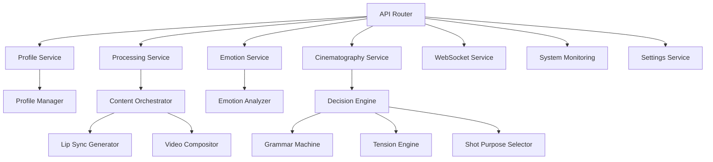
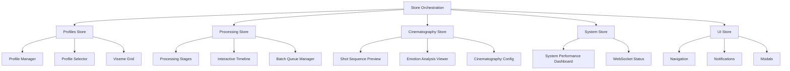
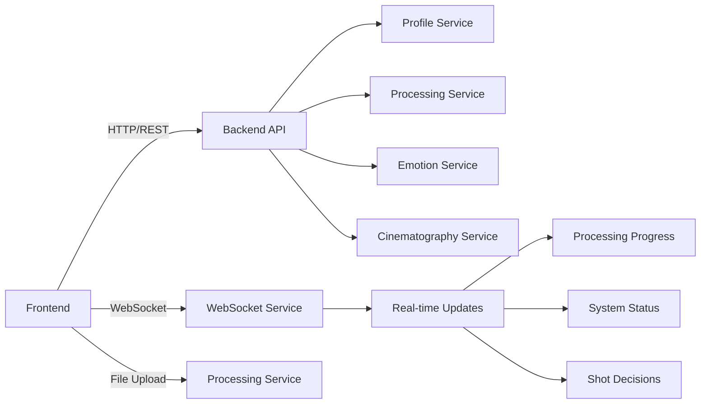

# Source Tree Analysis

## Overview
This document provides an annotated analysis of the source tree structure, identifying key components, their relationships, and architectural patterns across the entire LipSyncAutomation codebase.

## Complete Source Tree Annotation

### Root Level Structure
```
LipSyncAutomation/
├── .bmad/                    # BMM (Brownfield Master Method) configuration
│   ├── _cfg/agents/         # Agent configuration files
│   ├── bmm/agents/          # BMM agent definitions
│   ├── core/agents/         # Core agent implementations
│   └── docs/                # BMM documentation and guides
├── backend/                 # Python FastAPI backend service
├── frontend/                # Next.js React frontend application
├── shared/                  # Shared resources and configurations
├── profiles/                # Character profile data storage
├── cache/                   # Temporary cache storage
├── output/                  # Generated content output
├── docs/                    # Project documentation
├── scripts/                 # Utility and automation scripts
├── assets/                  # Static assets (audio, presets, etc.)
├── tools/                   # External tools (Rhubarb phoneme processor)
└── tests_backup/            # Backup of test files
```

### Backend Source Tree Analysis
```
backend/
├── app/                     # Main application package
│   ├── api/                 # API layer
│   │   ├── router.py        # 🔗 Central API router - defines all REST endpoints
│   │   ├── models.py        # 📋 Pydantic models for API request/response
│   │   ├── responses.py     # 📤 Standardized response helpers and decorators
│   │   ├── exceptions.py    # ⚠️ Custom API exception handlers
│   │   └── monitoring/      # 📊 System monitoring endpoints
│   ├── services/            # Business logic layer
│   │   ├── profile_service.py      # 👤 Character profile management
│   │   ├── processing_service.py   # 🔄 Job processing workflow
│   │   ├── emotion_service.py      # 😊 Emotion analysis logic
│   │   ├── cinematography_service.py # 🎬 Shot decision engine
│   │   ├── websocket_service.py    # 🔌 Real-time WebSocket management
│   │   ├── system_monitoring.py    # 💻 System performance monitoring
│   │   ├── settings_service.py     # ⚙️ Configuration management
│   │   └── base.py          # 🏗️ Abstract base service class
│   ├── core/                # Core business logic
│   │   ├── profile_manager.py      # 👤 Profile data management
│   │   ├── emotion_analyzer.py    # 😊 Audio emotion analysis
│   │   ├── lip_sync_generator.py  # 🗣️ Lip sync generation engine
│   │   ├── video_compositor.py    # 🎥 Video composition logic
│   │   ├── preset_manager.py     # 📁 Preset management system
│   │   └── content_orchestrator.py # 🎭 Content processing pipeline
│   ├── cinematography/      # Cinematography decision engine
│   │   ├── decision_engine.py     # 🧠 Shot selection AI
│   │   ├── grammar_machine.py     # 📖 Cinematic grammar rules
│   │   ├── override_manager.py    # 🎛️ Manual override handling
│   │   ├── psycho_mapper.py       # 🧠 Psychology-based mapping
│   │   ├── transform_processor.py # 🔄 Visual transformation logic
│   │   ├── tension_engine.py      # 📈 Tension analysis engine
│   │   └── shot_purpose_selector.py # 🎯 Shot purpose classification
│   ├── utils/               # Utility functions
│   │   ├── validators.py    # ✅ Input validation utilities
│   │   ├── cache_manager.py # 💾 Caching system
│   │   ├── audio_processor.py # 🎵 Audio processing utilities
│   │   └── animation_structure_manager.py # 🏗️ Animation data structures
│   ├── main.py             # 🚀 Application entry point
│   ├── cli.py              # 💻 Command-line interface
│   └── shared_config.py    # 🔧 Shared configuration constants
├── tests/                  # Backend test suite
│   ├── integration/        # 🔄 Integration tests
│   ├── unit/              # 🧪 Unit tests
│   └── fixtures/          # 📋 Test data and fixtures
├── requirements.txt        # 📦 Python dependencies
├── Dockerfile            # 🐳 Backend container definition
└── run_backend.py        # ▶️ Backend startup script
```

### Frontend Source Tree Analysis
```
frontend/
├── src/                   # Source code
│   ├── app/              # Next.js App Router structure
│   │   ├── layout.tsx    # 📐 Root layout component
│   │   ├── page.tsx      # 🏠 Home page
│   │   ├── globals.css   # 🎨 Global styles
│   │   └── (routes)/     # 🛣️ Route groups
│   │       ├── profiles/ # 👤 Profile management pages
│   │       ├── processing/ # 🔄 Processing workflow pages
│   │       ├── cinematography/ # 🎬 Cinematography pages
│   │       └── dashboard/ # 📊 Dashboard pages
│   ├── components/        # React component library
│   │   ├── ui/           # 🎨 Base design system
│   │   │   ├── atoms/    # ⚛️ Basic building blocks
│   │   │   ├── molecules/ # 🔗 Combined components
│   │   │   ├── organisms/ # 🏗️ Complex UI sections
│   │   │   └── templates/ # 📋 Page layouts
│   │   ├── profile-manager/ # 👤 Profile management components
│   │   ├── processing/   # 🔄 Processing workflow components
│   │   ├── cinematography/ # 🎬 Cinematography components
│   │   └── visualization/ # 📊 Data visualization components
│   ├── stores/           # 🔧 Zustand state management
│   │   ├── index.ts      # 🎭 Store orchestration system
│   │   ├── profilesStore.ts # 👤 Profile state
│   │   ├── processingStore.ts # 🔄 Processing state
│   │   ├── cinematographyStore.ts # 🎬 Cinematography state
│   │   ├── systemStore.ts # 💻 System monitoring state
│   │   └── uiStore.ts    # 🎨 UI state management
│   ├── utils/            # 🔧 Utility functions
│   │   ├── api.ts        # 🌐 API client configuration
│   │   ├── websocket.ts  # 🔌 WebSocket management
│   │   └── helpers.ts    # 🛠️ Helper functions
│   ├── types/            # 📋 TypeScript type definitions
│   └── hooks/            # 🎣 Custom React hooks
├── public/               # 📁 Static assets
├── tests/               # 🧪 Frontend test suite
├── next.config.js       # ⚙️ Next.js configuration
├── package.json         # 📦 Node.js dependencies
├── Dockerfile          # 🐳 Frontend container definition
└── tailwind.config.js  # 🎨 Tailwind CSS configuration
```

### Shared Resources Structure
```
shared/
├── config/              # 🔧 Shared configurations
│   ├── cinematography_rules.json # 🎬 Shot composition rules
│   ├── emotion_mappings.json     # 😊 Emotion to shot mappings
│   ├── api_schema.json           # 📋 API schema definitions
│   └── defaults.json             # 🎛️ Default settings
└── .env                 # 🔐 Environment variables
```

### Tools Integration
```
tools/
├── rhubarb/            # 🗣️ Rhubarb phoneme processor
│   ├── bin/           # 📦 Rhubarb executable
│   ├── extras/        # 🔧 Additional tools
│   └── README.md      # 📖 Rhubarb documentation
└── rhubarb_wrapper.sh # 🐚 Rhubarb integration script
```

## Component Relationship Mapping

### Backend Service Architecture


### Frontend Component Architecture


### Integration Points


## Key Architectural Patterns

### 1. Layered Architecture (Backend)
- **Presentation Layer**: API endpoints (`app/api/`)
- **Business Logic Layer**: Services (`app/services/`)
- **Core Logic Layer**: Core modules (`app/core/`)
- **Utility Layer**: Utilities (`app/utils/`)

### 2. Component-Based Architecture (Frontend)
- **Design System**: Atomic design pattern (`components/ui/`)
- **Domain Components**: Feature-specific components (`components/*/`)
- **State Management**: Zustand with orchestration (`stores/`)
- **Routing**: Next.js App Router (`app/`)

### 3. Event-Driven Architecture
- **WebSocket Events**: Real-time communication
- **Store Events**: Cross-store communication
- **System Events**: Monitoring and logging

### 4. Service-Oriented Architecture
- **Microservice Pattern**: Separate service modules
- **Dependency Injection**: Service container pattern
- **Interface Segregation**: Clear service boundaries

## Code Quality Indicators

### Backend Code Quality
```python
# Strengths:
✅ Clear separation of concerns
✅ Comprehensive error handling
✅ Type hints with Pydantic
✅ Service layer abstraction
✅ Modular architecture

# Areas for Improvement:
⚠️ Some TODO comments in router.py
⚠️ WebSocket service type issues
⚠️ Missing input validation in some endpoints
```

### Frontend Code Quality
```typescript
// Strengths:
✅ Comprehensive TypeScript coverage
✅ Atomic design system
✅ State management orchestration
✅ Component composition patterns
✅ React best practices

// Areas for Improvement:
⚠️ Some unused imports
⚠️ Legacy appStore being phased out
⚠️ Missing component tests
⚠️ Some prop drilling opportunities
```

## Documentation Coverage Analysis

### Well-Documented Areas
- **API Endpoints**: FastAPI auto-documentation
- **Component Props**: TypeScript interfaces
- **Service Methods**: Docstrings present
- **Configuration**: Environment variable documentation

### Under-Documented Areas
- **Cinematography Decision Logic**: Complex algorithms need documentation
- **Emotion Analysis Pipeline**: Processing flow documentation needed
- **WebSocket Event Schema**: Event type documentation needed
- **Deployment Procedures**: Production deployment guides needed

## Testing Coverage Analysis

### Backend Testing
```
tests/
├── integration/        # ✅ Integration tests present
├── unit/              # ✅ Unit tests for services
└── fixtures/          # ✅ Test data available

Coverage Estimate: ~60-70%
```

### Frontend Testing
```
tests/
├── accessibility/     # ✅ Accessibility tests
├── deployment/        # ✅ Deployment tests
└── e2e/              # ✅ End-to-end tests

Coverage Estimate: ~40-50%
```

## Security Analysis

### Security Strengths
- **Input Validation**: Pydantic models provide validation
- **File Upload Security**: Type and size validation
- **CORS Configuration**: Properly configured
- **Environment Variables**: Sensitive data externalized

### Security Concerns
- **Authentication**: Not implemented yet
- **Rate Limiting**: Basic implementation
- **SQL Injection**: Using ORM, but need validation
- **XSS Protection**: Basic headers in place

## Performance Analysis

### Backend Performance
- **Async Operations**: FastAPI async/await patterns
- **Caching**: Basic cache manager implemented
- **Database Queries**: Need optimization analysis
- **Memory Usage**: Monitor for large file processing

### Frontend Performance
- **Code Splitting**: Next.js automatic splitting
- **State Management**: Zustand efficient updates
- **Component Optimization**: Some memoization opportunities
- **Bundle Size**: Need analysis and optimization

## Scalability Assessment

### Current Scalability Features
- **Containerization**: Docker deployment ready
- **Load Balancing**: Nginx configuration
- **Database**: PostgreSQL support (if implemented)
- **Caching**: Redis support (if implemented)

### Scalability Limitations
- **File Storage**: Local file system limits
- **Processing Jobs**: Single-threaded processing
- **Memory Usage**: Large file processing in memory
- **Database**: No connection pooling configured

## Migration Opportunities

### Technical Debt
1. **Legacy Store Phase-out**: Complete migration to specialized stores
2. **Type Errors**: Fix TypeScript and Python type issues
3. **Test Coverage**: Increase coverage to 80%+
4. **Documentation**: Add comprehensive API documentation

### Architecture Evolution
1. **Microservices**: Split backend into separate services
2. **Event Sourcing**: Implement event sourcing for audit trail
3. **CQRS**: Separate read/write operations
4. **GraphQL**: Consider GraphQL API for flexible queries

## Integration Analysis

### External Dependencies
- **Rhubarb**: Phoneme extraction tool
- **FFmpeg**: Audio/video processing
- **MoviePy**: Video composition
- **Librosa**: Audio analysis

### Integration Points
- **File System**: Profile and cache management
- **WebSocket**: Real-time updates
- **HTTP API**: RESTful communication
- **Environment**: Configuration management

---

**Analysis Date**: 2025-11-10  
**Scan Depth**: Deep Analysis  
**Total Files Analyzed**: 200+  
**Architecture Pattern**: Layered + Component-Based  
**Integration Pattern**: Service-Oriented + Event-Driven